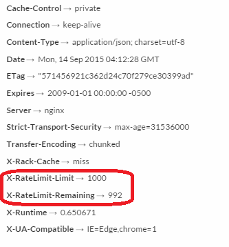

### API Rate Limit

Our API limits the number of calls that can be made in a specified time period.

WebAdMIT will allow an individual API Key to access the API up to 1,000 times in a 1-hour period. This should be more than sufficient for all normal access. Users can view the current API Rate Limit as well as how many calls an individual API Key has left in the current 1-hour period by viewing the `X-RateLimit-Limit` and `X-RateLimit-Remaining` response headers of any API call.

