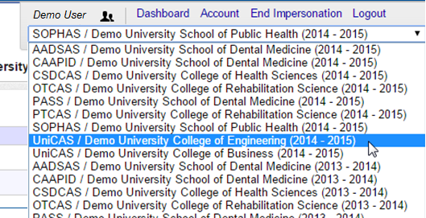

### What is a user identity in WebAdMIT?

Each of the selectable items in the standard WebAdMIT account dropdown are considered to be standard admissions-level **user identities**. For most universities, this ties to the cohorts of students from each major graduate department:

There are two additional "special" types of identities available in WebAdMIT:

  * An "Association User" can access data for all schools in a given Centralized Application Service. (For example, someone at ASPPH would be able to access all data for all schools of public health in SOPHAS, and someone at AACP would be able to access data for all schools of pharmacy in PharmCAS.)
  * An "Institution User" can access data for all departments & programs at a university implementing UniCAS. (This type of user would be able to create a university-wide data export.)

In general, configuration entities such as Lists, Exports, Email Templates, and so on in WebAdMIT are "owned" by one of a user's identities. Every identity that is part of a user's profile has a name and a unique identifier.  These can be retrieved via one of the API calls discussed in this documentation. Admissions, Association, and Institutional identities can all be addressed by name or ID in the same manner.
