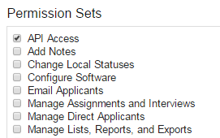
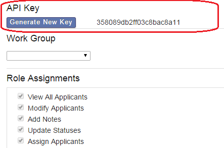

### WebAdMIT API Permissions and Keys

Access is controlled by permissions and API keys.

WebAdMIT user accounts who need access to the Export Manager API need to be given the "API Access" permission for each of the **user identities** that they have in the WebAdMIT system and that they wish to access via the API. This permission can also be made part of a standard WebAdMIT Work Group.

Users with API Access enabled on at least one of their WebAdMIT identities will be able to generate an API key in their Edit My Account section of WebAdMIT. This API key will then be associated with that user and **all** of their identities within WebAdMIT. If the key is compromised, it can be regenerated from this screen at any time. This API key must be passed in the HTTP header (key name of `x-api-key`) of all requests to the API, or requests will be rejected.

